 

 

## ⚡ Identity Scan

<!-- Custom scan-line HUD effect. Replace the <image href="..."> inside assets/scan.svg with your own photo. -->

 

## 🐍 Contribution Snake

<!--
  This is generated automatically by .github/workflows/snake.yml (Platane/snk action).
  Move that workflow file into `.github/workflows/snake.yml` in your repo, push to main,
  enable Actions, and this will populate itself within a few minutes.
-->
<picture>
  <source media="(prefers-color-scheme: dark)" srcset="https://raw.githubusercontent.com/Abhay2602-SA/Abhay2602-SA/output/github-contribution-grid-snake-dark.svg" />
  <source media="(prefers-color-scheme: light)" srcset="https://raw.githubusercontent.com/Abhay2602-SA/Abhay2602-SA/output/github-contribution-grid-snake.svg" />
  
</picture>

 

## 🧬 Tech Stack

 

## 🚀 Featured Builds

<table width="100%">
<tr>
<td width="50%" valign="top">

**[InvoiceAI](https://github.com/Abhay2602-SA)** — AI-powered invoicing platform
 FastAPI · React · PostgreSQL · Docker · Groq LLM
 JWT auth, natural-language invoice generation, OCR receipt scanning, automated reminders.

</td>
<td width="50%" valign="top">

**[Microgig](https://github.com/Abhay2602-SA)** — Freelance & gig marketplace
 React · Node.js · MongoDB · Stripe Connect · Socket.io
 Escrow payments, full contract lifecycle, real-time chat, admin dispute resolution.

</td>
</tr>
<tr>
<td width="50%" valign="top">

**[AS Watch-Together](https://github.com/Abhay2602-SA)** — Real-time watch-party platform
 Node.js · Socket.io · WebRTC · SQLite
 Synced playback, WebRTC video chat, AI-powered Q&A and live subtitle translation.

</td>
<td width="50%" valign="top">

**[SmartFace Attendance](https://github.com/Abhay2602-SA)** — Facial-recognition attendance
 Electron · face-api.js (TensorFlow.js)
 On-device face recognition, liveness detection, role-based dashboards.

</td>
</tr>
</table>

 

## 📡 Live Stats

 

Open to entry-level engineering roles — always up for a conversation about systems, code, or a good side project.

